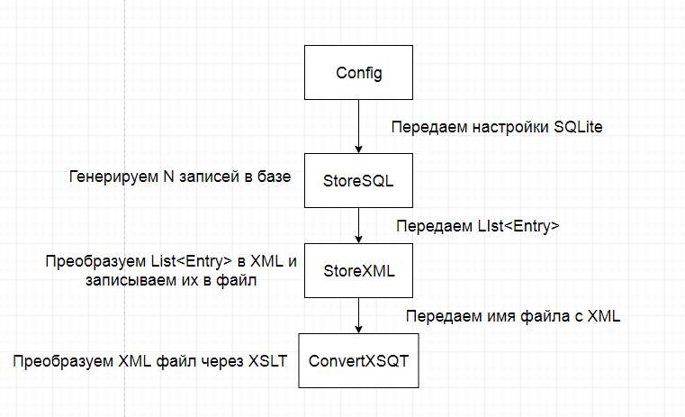

### XML XSLT JDBC Оптимизация

В задании нужно произвести процесс манипуляции над данными.
В качестве базы данных использовать SQLLite. 

Весь процесс выполнения программы можно описать в виде конвейера:

 
1.. Генерация данных в SQLLite описывается классом StoreSQL.
 StoreSQL(Config) - Config - объект содержащий настройки для подключения к базе. 
 Нужно проверить, существует ли база. Если нет, нужно создать заново.

2.. После запуска приложения:

2.1. Если таблица entry в БД отсутствует, то создает ее.

2.2. Вставляет в таблицу entry n записей со значениями 1..N. 
Если в таблице находились записи, то они удаляются перед вставкой.

При использовании режима autocommit  = false - нужно в блоке catch откатывать транзакцию transaction.rollback();

3.. Генерация XML из данных базы описывается классом StoreXML.
 
StoreXML(File target) - target - файл, куда будут сохраняться данные.
Метод save(List<Entry> list) - сохраняет данные из list в файл target. 
Данные нужно сохранить в виде XML. 
``` 
<entries>
<entry>
<field>значение поля field</field>
</entry>
...
<entry>
<field>значение поля field</field>
</entry>
</entries>
```

Вывод в консоль:
``` 
<?xml version="1.0" encoding="UTF-8" standalone="yes"?>
<user>
 <values>
 <value>1</value>
 </values>
 <values>
 <value>2</value>
 </values>
</user>
```
Класс User, Field = описываются JavaBean.

Для создания xml файла нужно использовать технологию JAXB - https://www.mkyong.com/java/jaxb-hello-world-example/

4.. Преобразовать полученный файл из пункта 3 в файл другого XML формата через XSLT.
 
Этот процесс будет описываться классом - ConvertXSLT.

Метод convert(File source, File dest, File scheme) - читает файл source и преобразовывает его в файл dest за счет XSLT схемы.
 
Получаемый после преобразования файл должен выглядеть следующим образом.
``` 
<entries>
<entry field="значение поля field">
...
<entry field="значение поля field">
</entries>
```
Вывод в консоль:
```
<?xml version="1.0" encoding="UTF-8"?>
<entries>
   <entry href="1"/>
   <entry href="2"/>
</entries>
```
Для преобразования использовать XSLT - https://docs.oracle.com/javase/tutorial/jaxp/xslt/transformingXML.html

5.. Приложение парсит выходной файл из пункта 4 и выводит арифметическую сумму значений всех атрибутов
field в консоль.
 
Для парсинга использовать технологию SAX - https://docs.oracle.com/javase/tutorial/jaxp/sax/parsing.html

6.. При больших N (~1000000) время работы приложения не должно быть более пяти минут.
